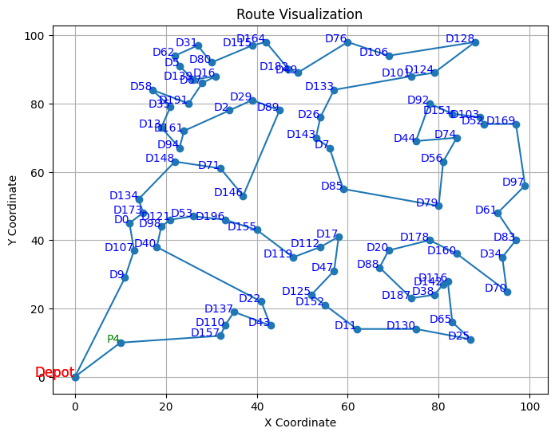

# Routing Optimization

A Python package for planning delivery and pickup routes for vehicles.

The algorithm includes the following steps:

1. Sort deliveries based on capacity and greedily add deliveries;

2. Select the pickup by ranking both distance from depot and capacity;

3. Build a route using the **Nearest Neighbor** heuristic;

4. Chain capacity-constrained **2-opt** and **3-opt** to reduce the route length.

## Discussion on choice of algorithms

**Nearest Neighbor** quickly generates an initial feasible route by always visiting the closest next stop. **2-opt** then improves the route by removing simple crossing paths. However, **2-opt** struggles with multiple crossings, especially in larger cases where the route returning to the depot intersects several other segments. To address this, **3-opt** is applied to further refine the route and reduce total distance.

Limitations: This approach does not guarantee a global optimum. Additionally, **3-opt** has O(n³) complexity, which can make it slow for very large problem instances.

## Installation

Install `uv` with:

```bash
curl -LsSf https://astral.sh/uv/install.sh | sh
```

Reload your shell:

```bash
source ~/.profile
```

Clone the repository and run `uv sync`:
```bash
git clone https://github.com/yourusername/routing_optimization.git
cd routing_optimization
uv sync
```

## Usage

Prepare input JSON, example:
```json
{
  "vehicle_capacity": 15,
  "deliveries": [
    {"id": 0, "x": 1, "y": 2, "capacity": 5},
    {"id": 1, "x": 4, "y": 1, "capacity": 3}
  ],
  "pickups": [
    {"id": 0, "x": 3, "y": 5, "capacity": 8},
    {"id": 1, "x": 6, "y": 2, "capacity": 4}
  ]
}
```

Run:
```bash
uv run src/routing_optimization/main.py <path-to-json>
```

## Examples

A notebook is available in the `scripts/` folder. Sample input data are in the `data/` folder. The notebook demonstrates how to load data, plan routes, and visualize results. See a quick result visualization below:

